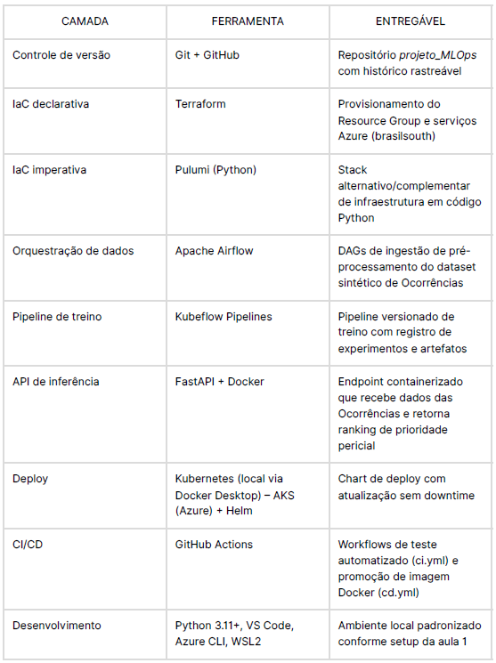
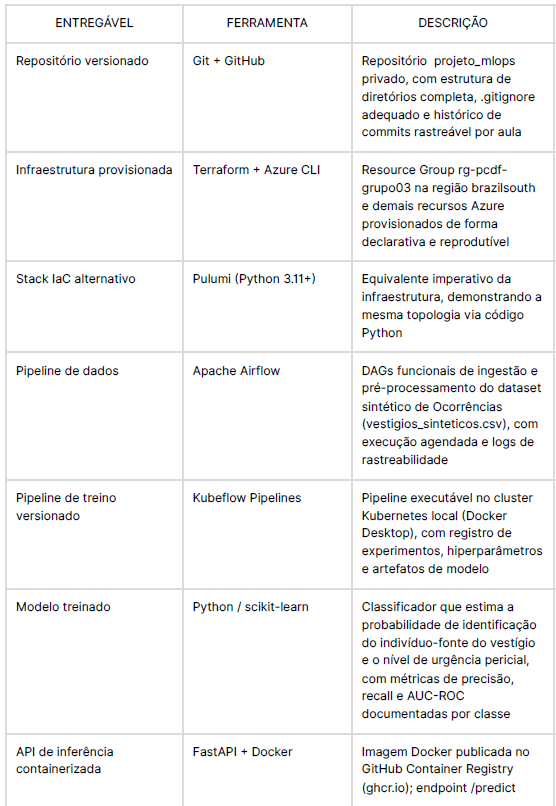
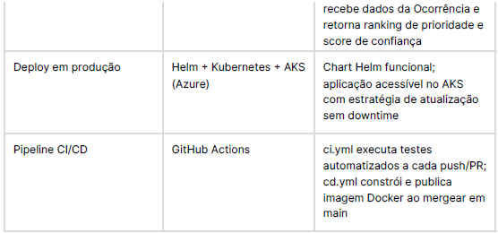

# Objetivo do projeto

Classificar e priorizar automaticamente a ordem de Ocorrências a serem periciadas (perícia
papiloscópica): a partir dos dados usados no treinamento do ML, o modelo sugere a hierarquia de probabilidades de resultados (identificação do indivíduo fonte do vestígio)e o nível de urgência, apoiando o encaminhamento mais rápido à seção de exames periciais papiloscópicos.

O modelo não substitui a decisão humana do perito em Papiloscopia — apenas prioriza a fila
de trabalho.

# Escopo

O projeto abrange o desenvolvimento de um pipeline MLOps ponta a ponta para triagem
automatizada de Ocorrências Policiais com registro de vestígios biométricos após perícia local e/ou laboratorial, cobrindo as camadas de infraestrutura, dados, treino, serviço e operação. As ferramentas utilizadas seguem o stack definido na disciplina.

## Dentro do escopo:

## Dataset sintético

Sem dados reais ou informações pessoais.
vestigios_sinteticos.csv com aproximadamente 500 registros fictícios de perícias, contendo variáveis representativas do contexto pericial papiloscópico, devidamente pré-processado, codificado e pronto para alimentar o pipeline de treinamento supervisionado. Dados de cada registro:
1. Tipo de Perícia (roubo, furto qualificado em residência, homicidio, feminicidio, dano, furto em residência)
2. Tipo de Local (pátio, DP, residência, via pública, estabelecimento comercial, etc)
3. Quantidade de objetos
4. Quantidade de Fotos de Vestígios de impressão papiloscópica (VIP)
5. Quantidades de Fitas
6. Vestígio com biometria facial: true/false
7. Horário do Exame
8. Técnica utilizada (empoamento, macrofotografia, luz forense/lanterna) Uma ou mais
9. Delegacia
10. Violência doméstica: true/false
11. Vítima idosa: true /false
12. Vítima criança: true/false

## Fora do escopo

(a) Integração com sistemas da Instituição (dados reais)
(b) Execução efetiva da análise papiloscópica (o modelo não acessa imagens de impressões digitais - não trabalha com visão computacional)
(c) Substituição de qualquer etapa da cadeia de custódia ou decisão pericial

# Resultados esperados

Com base no escopo definido e no stack MLOps adotado, espera-se que o sistema entregue os seguintes resultados ao final do projeto:

1. Dataset sintético estruturado:
arquivo vestigios_sinteticos.csv com aproximadamente 500 registros fictícios, pré-processado e ingerido por DAGs do Apache Airflow com execução agendada e rastreabilidade de logs.
2. Infraestrutura provisionada e repositório versionado: recursos Azure provisionados via Terraform e Pulumi (Python 3.11+); código e histórico mantidos no repositório privado projeto_MLOps no GitHub.

3. Modelo treinado e registrado: classificador scikit-learn com métricas documentadas (acurácia, F1-score, AUC-ROC), orquestrado pelo Kubeflow Pipelines com registro automático de experimentos e artefatos.

4. API de inferência containerizada: API FastAPI empacotada em Docker, com endpoint/predict retornando ranking de prioridade e score de confiança sem substituir a decisão pericial.

5. Pipeline CI/CD com gates de qualidade: GitHub Actions automatizando testes e publicação da imagem com barreiras que bloqueiam modelos abaixo do limiar de desempenho.

6. Painel de observabilidade: Dashboard com fila de ocorrências ordenada por prioridade inferida e indicadores de urgência e vulnerabilidade, otimizando o encaminhamento sem interferir na autonomia do perito papiloscopista.